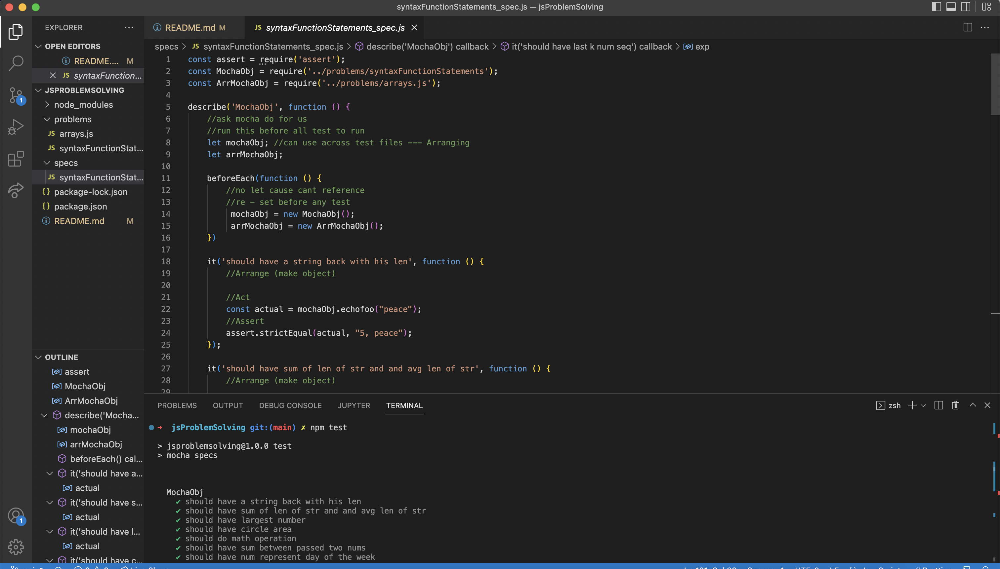

# JSproblems
> Live demo [_here_](https://www.example.com). <!-- If you have the project hosted somewhere, include the link here. -->

## Table of Contents
* [General Info](#general-information)
* [Technologies Used](#technologies-used)
* [Features](#features)
* [Screenshots](#screenshots)
* [Setup](#setup)
* [Usage](#usage)
* [Project Status](#project-status)
* [Contact](#contact)
<!-- * [License](#license) -->

## General Information
- JavaScriptProblems provides a variety of JavaScript practice exercises.

## Technologies Used

- Node.js - v19.8.1
- Mocha
- Visual Studio Code - v1.71.2
- macOS - v12.6

## Features

- JS Syntax, Functions and Statements.
- Arrays and Nested Arrays.

## Screenshots

<!--  -->
<!-- If you have screenshots you'd like to share, include them here. -->

## Setup

<!-- Proceed to describe how to install / get started with the project. -->

## Usage
<!-- How does one go about using it? -->

## Project Status
Project is: _in progress_ 

## Contact
Created by [@GGG](http://3gbg.s3-website.eu-west-2.amazonaws.com/#intro) - feel free to contact me!

<!-- 01. Syntax, Functions and Statements
02. Arrays and Nested Arrays 
03. Objects and Composition
04. DOM Introduction
05. DOM Manipulation and Events 
06. Advanced Functions 
07. Unit Testing and Error Handling
08. Classes and Attributes 
09. Prototypes and Inheritance -->