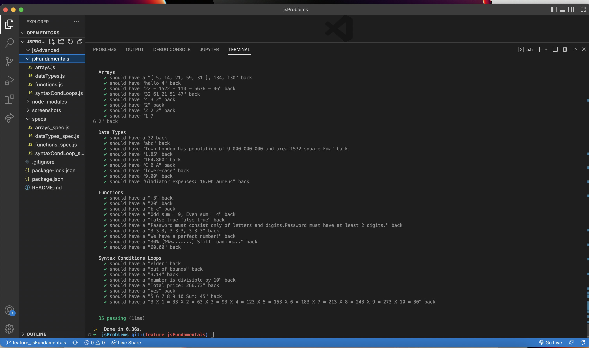

# JSproblems
> Live demo [_here_](). <!-- If you have the project hosted somewhere, include the link here. -->

## Table of Contents
* [General Info](#general-information)
* [Technologies Used](#technologies-used)
* [Features](#features)
* [Screenshots](#screenshots)
* [Setup](#setup)
* [Usage](#usage)
* [Project Status](#project-status)
* [Contact](#contact)
<!-- * [License](#license) -->

## General Information
- JavaScriptProblems provides a variety of JavaScript practice exercises.

## Technologies Used

- Node.js - v19.8.1
- Mocha
- Visual Studio Code - v1.71.2
- macOS - v12.6

## Features

#### JS Fundamentals 

- JS Syntax, Conditions and Loops exercises.
- Data Types and Variables exercises.
- Arrays exercises.
- Functions exercises.
- Arrays Advanced exercises.
- Objects and Classes exercises.
- Associative Arrays exercises.
- Text Processing exercises.
- Regular Expressions exercises.

#### JS Advanced 
- Syntax, Functions and Statements
- Arrays and Nested Arrays
- Objects and Composition
- DOM Introduction 
- DOM Manipulation and Events
- Advanced Functions
- Unit Testing and Error Handling
- Classes and Attributes
- Prototypes and Inheritance

## Screenshots

<!--  -->
<!-- If you have screenshots you'd like to share, include them here. -->

## Setup

<!-- Proceed to describe how to install / get started with the project. -->
- Clone repo git clone https://github.com/gergacio/JSproblems.git
- run npm install
- run yarn run test

## Usage
<!-- How does one go about using it? -->

## Project Status
Project is: _in progress_ 

## Contact
Created by [@GGG](http://3gbg.s3-website.eu-west-2.amazonaws.com/#intro) - feel free to contact me!
